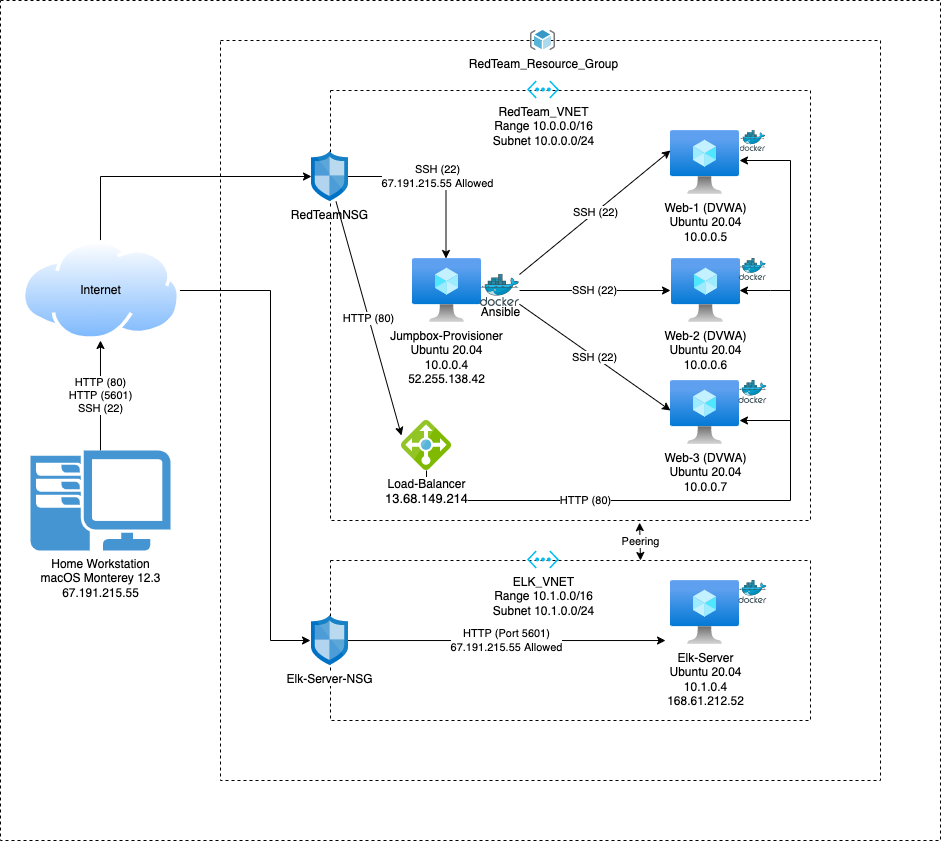
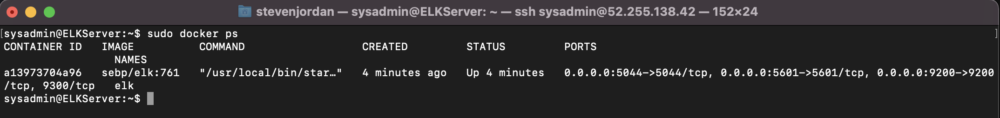

## Automated ELK Stack Deployment

The files in this repository were used to configure the network depicted below.

These files have been tested and used to generate a live ELK deployment on Azure. They can be used to either recreate the entire deployment pictured above. Alternatively, select portions of the **playbook** file may be used to install only certain pieces of it, such as Filebeat.

  - [filebeat-playbook.yml](https://github.com/sjglock/Project1/blob/main/Ansible/filebeat-playbook.yml)

This document contains the following details:
- Description of the Topology
- Access Policies
- ELK Configuration
  - Beats in Use
  - Machines Being Monitored
- How to Use the Ansible Build

### Description of the Topology

The main purpose of this network is to expose a load-balanced and monitored instance of DVWA, the D*mn Vulnerable Web Application.

Load balancing ensures that the application will be highly efficient, in addition to restricting access to the network.
- Load balancers are an additional layer of protection to the firewall to prevent unauthorized traffic from accessing the web machine, help prevent dDOS attacks, and minimizes the downtime if one server goes down. The main advantage of a jump box is to act as an intermediary between the internet and the web machines by adding an additional layer of protection and further restricting the ports that can access the web machines.

Integrating an ELK server allows users to easily monitor the vulnerable VMs for changes to the log files and system services.
- _Filebeat monitors the log files or locations that you specify, collects log events, and forwards them either to Elasticsearch or Logstash for indexing._
- _Metricbeat helps you monitor your servers by collecting metrics from the system and services running on the server, such as: Apache._

The configuration details of each machine may be found below.

| Name                 | Function   | IP Address                                | Operating System |
|----------------------|------------|-------------------------------------------|------------------|
| Jump-Box_Provisioner | Gateway    | 10.0.0.4 (Private) 52.255.138.42 (Public) | Linux            |
| Web-1                | Webserver  | 10.0.0.5                                  | Linux            |
| Web-2                | Webserver  | 10.0.0.6                                  | Linux            |
| Web-3                | Webserver  | 10.0.0.7                                  | Linux            |
| ELK-Server           | Elk Server | 10.1.0.4 (Private) 168.61.212.52 (Public) | Linux            |

### Access Policies

The machines on the internal network are not exposed to the public Internet. 

Only the Jump Box machine can accept connections from the Internet. Access to this machine is only allowed from the following IP addresses:
- 67.191.215.55 (Home Public IP)

Machines within the network can only be accessed by the Jump Box.
- The Jump Box has a Public IP of 52.255.138.42 and a Private IP of 10.0.0.4

A summary of the access policies in place can be found in the table below.

| Name                 | Publicly Accessible | Allowed IP Addresses                                                     |
|----------------------|---------------------|--------------------------------------------------------------------------|
| Jump-Box_Provisioner | Yes SSH (22)        | 10.0.0.0/24 (RedTeam_VNET) 10.1.0.0/24 (ELK_VNET) 67.191.215.55 (Public) |
| Web-1                | No                  | 10.0.0.0/24 (RedTeam_VNET) 10.1.0.0/24 (ELK_VNET)                        |
| Web-2                | No                  | 10.0.0.0/24 (RedTeam_VNET) 10.1.0.0/24 (ELK_VNET)                        |
| Web-3                | No                  | 10.0.0.0/24 (RedTeam_VNET) 10.1.0.0/24 (ELK_VNET)                        |
| ELK-Server           | Yes http (5601)     | 10.0.0.0/24 (RedTeam_VNET) 10.1.0.0/24 (ELK_VNET) 67.191.215.55 (Public) |

### Elk Configuration

Ansible was used to automate configuration of the ELK machine. No configuration was performed manually, which is advantageous because...
- Ansible's main advantage is that it can be run from the command line without requiring configuration files for simple tasks such as services, updates, and reboots. Ansible also makes deploying multiple simultaneous machines easier.

The playbook implements the following tasks:
- Install Docker
- Install pip3
-	Install Docker Python Module
-	Increase Virtual Memory
-	download and launch a docker elk container
-	Enable service docker on boot

The following screenshot displays the result of running `docker ps` after successfully configuring the ELK instance.

### Target Machines & Beats
This ELK server is configured to monitor the following machines:
- 10.0.0.5 (Web-1), 10.0.0.6 (Web-2), 10.0.0.7 (Web-3) 
We have installed the following Beats on these machines:
- Filebeat and Metricbeat

These Beats allow us to collect the following information from each machine:
- Filebeats monitors log files and log events.  Example Apache log files 
- Metricbeats moitors system services and provides metrics. Example CPU Usage and uptime

### Using the Playbook
In order to use the playbook, you will need to have an Ansible control node already configured. Assuming you have such a control node provisioned: 

SSH into the control node and follow the steps below:
- Copy the configuration file [filebeat-config.yml](Ansible/filebeat-config.yml) [metricbeat-config.yml](Ansible/metricbeat-config.yml) to /etc/ansible/files.
- Update the configuration file to include the IP Address of the ELK Server
- Write the playbooks to include the commands that should be pushed to the webservers. [filebeat-playbook.yml](Ansible/filebeat-playbook.yml) [metricbeat-playbook.yml](Ansible/metricbeat-playbook.yml)
- Run the playbook, and navigate to Elk Server to check that the installation worked as expected.

_TODO: Answer the following questions to fill in the blanks:_
- _Which file is the playbook? Where do you copy it?_
- _Which file do you update to make Ansible run the playbook on a specific machine? How do I specify which machine to install the ELK server on versus which to install Filebeat on?_
- _Which URL do you navigate to in order to check that the ELK server is running?

_As a **Bonus**, provide the specific commands the user will need to run to download the playbook, update the files, etc._
